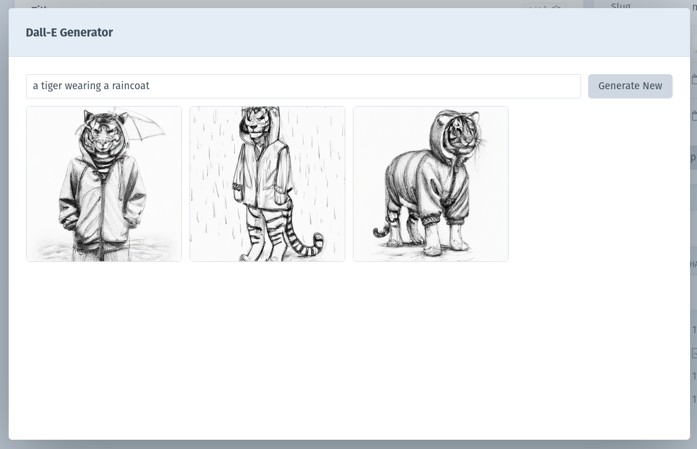

# Dall-E Fieldtype for Craft CMS 4.x

Created by [Servd](https://servd.host)

## About

Stop searching for stock images for your blog posts and simply generate them instead!

This Craft CMS Plugin adds a new fieldtype to Craft which acts exactly like a normal Asset selection field, but allows you to generate images using the Open AI DALL-E API instead of uploading an image.

## Pricing

The license fee for this plugin is $39 via the Craft Plugin Store. This is for the plugin only. Additional costs generated by the use of the Open AI API are not included. You read more about Open AI DALL-E pricing here: [https://openai.com/api/pricing/](https://openai.com/api/pricing/).

## Getting Started

1. Install the plugin in your Craft CMS 4+ project via the command line or plugin store
2. Create an Open AI API account [here](https://openai.com/api/)
3. [Add billing details](https://beta.openai.com/account/billing/overview) to your Open AI API account
4. Copy your [Open AI API key](https://beta.openai.com/account/api-keys)
5. Add your API key to this plugin's settings
6. Add an 'Assets with DALL-E' field to your Craft project

## Features

- Generate DALL-E images with custom prompts directly Craft's Control Panel
- Set common prompt prefixes and suffixes to maintain a consistent art style for specific Asset fields
- Generate 'variations' of an image to provide several similar options
- Convert square DALL-E images to landscape by generating additional edge content (optionally with a different prompt!)
- Selected images are stored as regular image Assets in Craft

## Rate Limiting

**The Open AI API is currently in beta and has a Rate Limit of 10 images per 60s in place. It is quite easy to hit this limit using this plugin. If you do hit the limit you will not be charged for failed image generations and you'll need to a simply wait a little while for it to reset.**

## Configuration

### Plugin Settings

- Dall-E API Key - The API key used to communicate with the Open AI API. We recommend setting this to an environment variable to ensure your API key isn't added to your project's git repo via the Project Config files.
- Generation count - Controls the number of images generated for each 'action' taken by the plugin. The Open AI API charges per-image generated, so this allows you to reduce the total cost at the expense of being provided less options to choose from within Craft.

### Field Settings

As well as all of the standard Asset field settings, the Assets with DALL-E field has the following additional settings:

- Image generation prompt prefix - Optionally specify a prompt prefix which will be used for all images created via this field. This is useful as a way to define a common art style. E.G: 'A detailed pencil sketch of'.

- Image generation prompt suffix - Optionally specify a prompt suffix which will be used for all images created via this field. This can be used to define common prompt modifiers. E.G: 'photo, wide angle, cannon, f1.2, flash on'

## Using the field

The Assets with DALL-E field functions exactly like a regular Asset field except that it has an additional button labelled 'Generate Image with DALL-E' next to the existing 'Add an Asset' and 'Upload a file' buttons.

Clicking this buttion launches a modal within which the image generation and selection takes place.

The first step to generating a new image is to type a 'Prompt' into the prompt input box. The prompt defines the content of the image that DALL-E will attempt to generate. If your field has any prefix or suffix defined, these will be added to your prompt before it is sent to the DALL-E API.

After adding your prompt, click the 'Generate New' button to create your images! The number of images created is determined by the 'Generation count' plugin setting.

If you see an image that you like, the next step is to 'Select' it by hovering over the image and clicking the button. This will take you to the Image Details page.

Mouse over the selected image on the left to zoom in and check to see what it looks like up-close. 

If you spot any small issues, but you like the image in general, use the 'Generate variants' button to create more images similar to the currently select one. If you prefer a variant, simply 'Select' it.

Once you've found an image that you're happy with you can click the 'Use this' button on the left hand side to save your image and convert it into a Craft Asset. All DALL-E generated images are square, so this image will be saved as a square.

If you require a landscape image, simply click the 'Extend horizontally' button. This will generate options for the left and right sides of your extended image. You can select any combination of the left and right options to form your newly widened image. Once both left and right sides are selected, click the 'Use selected pair' button to save your image and convert it into a Craft Asset.

*Pro tip: You can change the prompt text in the Prompt field before clicking the 'Extend horizontally' button in order to change the content generated in the newly generated sections - the original image in the centre will remain as-is*

## Updating Existing Assets Fields

We've tested converting a vanilla Assets field to an Assets with DALL-E field and haven't encountered any problems - this includes running through a staging and production deployment using project config. However, we recommend performing a full database backup before upgrading your production environment if you are changing a field which is already widely in use.